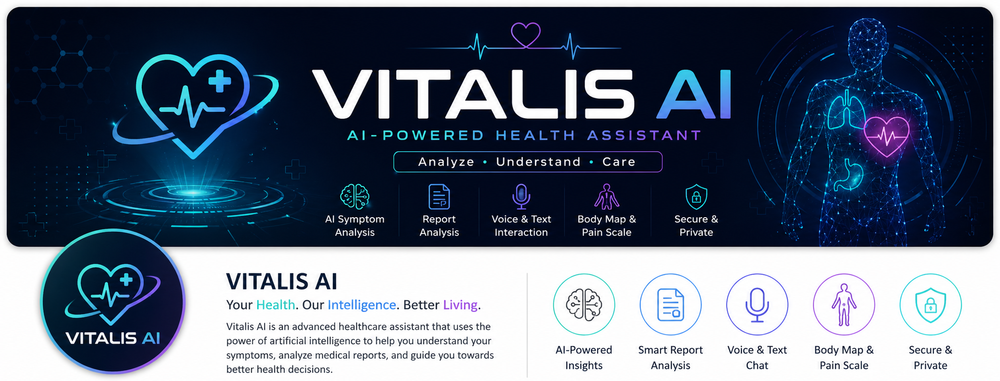
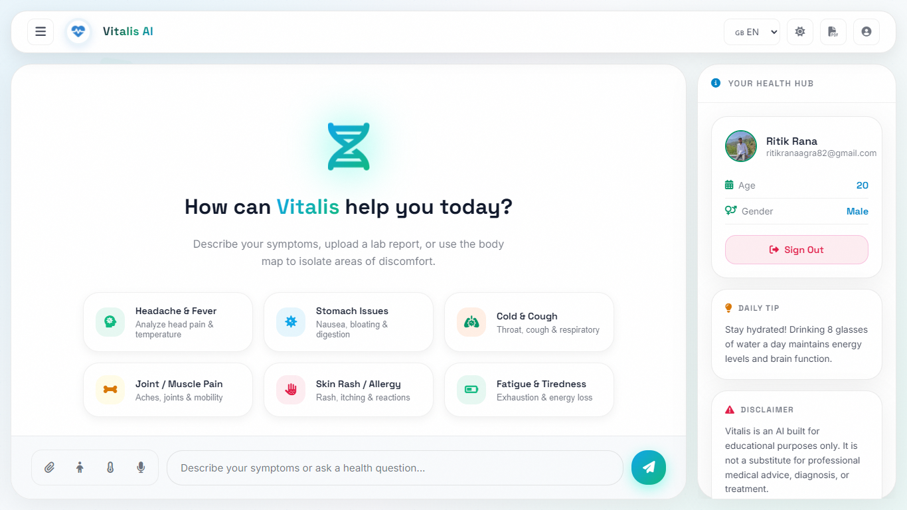

<div align="center">
  
  
  # 🧬 Vitalis AI
  
  **An intelligent, futuristic healthcare assistant powered by a custom fine-tuned Large Language Model (Llama-3).**
  
  [](https://ai.meta.com/llama/)
  [](https://vercel.com/)
  
  
</div>

## 📖 About Vitalis AI

**Vitalis AI** is a next-generation, clinical-grade healthcare chatbot designed to democratize access to medical information. Traditional healthcare can often be slow and inaccessible, leaving patients anxious while waiting for basic symptom analysis. Vitalis AI bridges this gap by providing immediate, highly accurate, and empathetic medical insights directly from your browser. 

Built with a stunning, responsive **glassmorphism UI**, the application feels premium, intuitive, and deeply interactive. Under the hood, the brain of Vitalis is powered by a **custom fine-tuned Llama-3 (8B) Large Language Model**. By specifically training the model on the comprehensive *ChatDoctor* dataset using cutting-edge Unsloth optimization techniques, Vitalis transcends generic AI responses. It acts as a specialized medical assistant capable of interpreting symptoms, asking dynamic follow-up questions, supporting multiple languages in real-time, and generating personalized daily health tips.

Whether you are logging a minor headache using our interactive human body map, uploading clinical images for context, or exporting a diagnostic session as a PDF for your doctor, Vitalis AI is engineered to be the ultimate personal health hub.

---

## 📑 Table of Contents
- [📸 Dashboard Preview](#-dashboard-preview)
- [✨ Core Features](#-core-features)
- [🛠️ Tech Stack & Architecture](#️-tech-stack--architecture)
- [📂 Project Structure](#-project-structure)
- [🚀 Installation & Setup](#-installation--setup)
- [💡 Usage Guide](#-usage-guide)
- [🤝 Contributing](#-contributing)
- [📄 License](#-license)

---

## 📸 Dashboard Preview

<div align="center">
  
</div>

---

## ✨ Core Features

| Feature | Description |
| :--- | :--- |
| 🔐 **Secure Authentication** | Google Sign-In powered by Firebase Authentication for seamless onboarding. |
| 🗄️ **Persistent Data** | Saves user profiles and demographic data using NeonDB (Serverless PostgreSQL). |
| 🗂️ **Session Management** | Start new consultations, view past history, and rename/delete previous chat sessions. |
| 🧠 **Custom Healthcare AI** | Powered by a fine-tuned Llama-3 8B model (trained via Unsloth on the ChatDoctor dataset). |
| ☁️ **Serverless Inference** | AI model compressed to GGUF format and hosted 24/7 on Hugging Face Spaces via FastAPI. |
| 🧍 **Interactive Body Map** | Pinpoint exactly where it hurts using a clickable SVG human anatomy map. |
| 🌡️ **Dynamic Pain Scale** | Log symptom severity with a visual 1-10 slider featuring animated emoji feedback. |
| 💬 **Smart Suggestions** | Context-aware follow-up questions generated to guide the conversation. |
| 🎤 **Voice Input** | Speak directly to the AI for a hands-free diagnostic experience using the Web Speech API. |
| ⚡ **Quick Prompts** | Instantly analyze common issues (Headache, Fever, Cold, etc.) with a single click. |
| 🌍 **Multilingual Support** | Chat seamlessly in English, Spanish, French, Hindi, Chinese, or Arabic. |
| 🌓 **Dynamic Theme** | Beautiful dark mode (Carbon Black) and sleek light mode (Porcelain Base) with smooth CSS transitions. |
| 🖨️ **Export Session** | Download your entire diagnostic session as a clean, formatted PDF for personal records. |

---

## 🛠️ Tech Stack & Architecture

### **Frontend**
- **HTML5 & CSS3:** Semantic markup, CSS Custom Properties, Glassmorphism aesthetics, and keyframe animations.
- **Vanilla JavaScript (ES6+):** Modular DOM manipulation, asynchronous API handling, and event-driven architecture.
- **Firebase:** Google OAuth Authentication logic.

### **Backend & APIs**
- **Vercel Serverless Functions:** Node.js API routes handling business logic (`/api/chat`, `/api/getHistory`, etc.).
- **NeonDB:** Serverless PostgreSQL database for persistent user data and chat session storage.

### **Artificial Intelligence Engine**
- **Base Model:** Meta Llama-3 (8 Billion Parameters).
- **Fine-tuning:** LoRA fine-tuning using Unsloth & Google Colab on the Hugging Face `ChatDoctor` dataset.
- **Inference:** `llama.cpp` (GGUF compression) hosted via FastAPI and Uvicorn.
- **AI Hosting:** Hugging Face Spaces (Docker environment) for a free, 24/7 endpoint.

---

## 📂 Project Structure

```text
Vitalis-AI/
├── api/                 # Vercel Serverless Functions (Node.js/Postgres/Fetch)
│   ├── chat.js          # Proxies chat requests to Hugging Face Space
│   ├── getUser.js       # Fetches user demographics from NeonDB
│   ├── saveUser.js      # Saves new Google Auth users into NeonDB
│   ├── getHistory.js    # Fetches past chat sessions and messages
│   ├── saveMessage.js   # Saves chat messages with session IDs
│   ├── renameChat.js    # Renames an existing chat session
│   └── deleteChat.js    # Deletes an entire chat session
├── assets/              # Logos, demo GIFs, and screenshot images
├── index.html           # Main UI dashboard and modal layouts
├── script.js            # Core frontend logic, Firebase Auth, and DOM interactions
├── style.css            # Responsive styles, theme variables, and animations
├── package.json         # Backend dependencies (pg, dotenv)
├── vercel.json          # Deployment configuration (optional)
└── README.md            # Project documentation
```

---

## 🚀 Installation & Setup

### 1. Clone the Repository
```bash
git clone https://github.com/Ritik0102-bit/Vitalis-AI.git
cd Vitalis-AI
npm install
```

### 2. Environment Variables
Create a `.env` file in the root directory and add your credentials:
```env
DATABASE_URL="postgresql://<user>:<password>@<neon-host>/neondb?sslmode=require"
CUSTOM_LLM_URL="https://your-huggingface-space.hf.space/chat"
```
*(Ensure your Firebase configuration keys are updated in `index.html`).*

### 3. Run Locally (Vercel Dev)
Because this project utilizes Serverless APIs, you must run it using the Vercel CLI:
```bash
npm i -g vercel
vercel dev
```
The application will now be available at `http://localhost:3000`.

### 4. Deploy to Production
To deploy your application publicly:
```bash
vercel --prod
```
*Note: Make sure to add your Environment Variables to the Vercel Dashboard, and whitelist your new Vercel domain in your Firebase Auth settings!*

---

## 💡 Usage Guide

1. **Sign In:** Authenticate securely using the Google Sign-In popup.
2. **Onboarding:** Enter your Age and Gender upon your first login.
3. **Describe Symptoms:** Type your symptoms into the chat box, click the Microphone icon to dictate them, or use the Quick Action Prompts.
4. **Visual Tools:** Utilize the Child Icon for the Body Map or the Thermometer for the pain scale.
5. **Manage Consultations:** Navigate between past sessions using the left sidebar. Hover over any past session to rename or delete it.
6. **Interact:** Receive hyper-accurate, empathetic medical responses generated directly from the Custom Llama-3 AI server.

---

## 🤝 Contributing

Contributions, issues, and feature requests are highly appreciated! Feel free to check out the [issues page](https://github.com/Ritik0102-bit/Vitalis-AI/issues).

1. Fork the Project
2. Create your Feature Branch (`git checkout -b feature/AmazingFeature`)
3. Commit your Changes (`git commit -m 'Add some AmazingFeature'`)
4. Push to the Branch (`git push origin feature/AmazingFeature`)
5. Open a Pull Request

---

## 📄 License

Distributed under the MIT License. See `LICENSE` for more information.

---

## ✍️ Author

**Ritik Rana**
* GitHub: [@Ritik0102-bit](https://github.com/Ritik0102-bit)

---
<div align="center">
  <sub>Built with ❤️ by Ritik Rana</sub>
</div>
